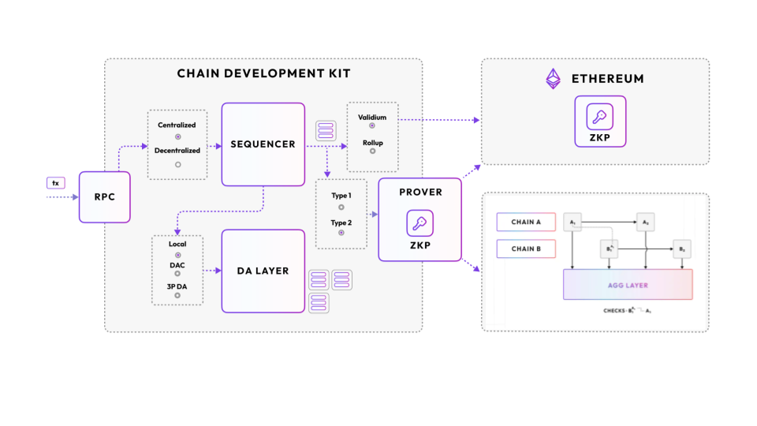

# Polygon CDK

Polygon CDK (Chain Development Kit) is a modular, open-source software toolkit designed for blockchain developers. It enables the creation of new Layer 2 (L2) chains on Ethereum using zero-knowledge proofs (zkEVM) and optional validium technology. Here are some key points about 

### Polygon CDK:

- Purpose: The Polygon CDK empowers developers to launch new L2 chains by providing essential tools and components.
- Zero-Knowledge Proofs: It supports the implementation of zero-knowledge proofs, which enhance privacy and scalability.
- Validium Option: Developers can choose to incorporate validium, an additional layer of scalability, if needed.
- Modularity: The CDK is designed in a modular fashion, allowing flexibility and customization.
- Chain Architectures: It assists with the installation and configuration of various chain architectures.

For more detailed information, you can explore the official [Polygon CDK documentation.](https://docs.polygon.technology/cdk/)
